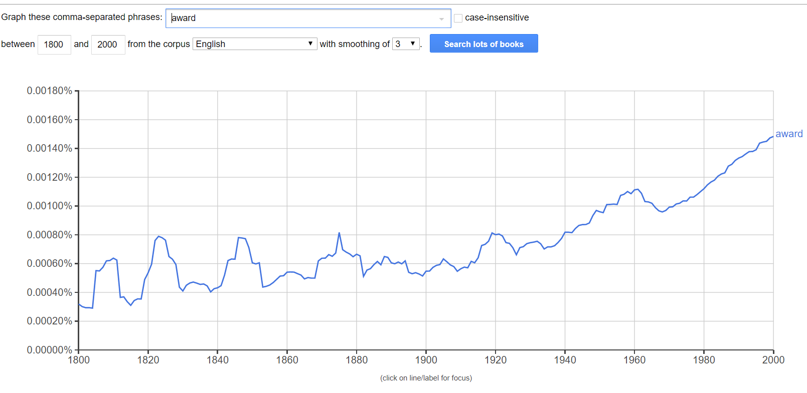

# hw6
# Часть 1
## Задание 1
10 самых частотных продолжений фразы **DUE TO THE**

***

## Задание 2
Одно слово - разные части речи

***

## Задание 3
Два синонима: **biscuit VS cookie**

Не могла определиться, поэтому данные за **2009** год:

И данные за **2012** год:

**ВЫВОД**
Исходя из графиков, можно заметить, что слово *biscuit* наиболее употребляемо в British english, а слово *cooke* - в American english. Основываясь на знаниях, полученных в ходе изучения английского языка, я подтверждаю эту информацию. Причем тенденции за 2009 и 2012 год совпадают, а именно:
- лидирущую позицию занимает слово *cookie* в American english, набирая полпулярность в 1940-х
- к 2000-му году употребление данных слов в противоположных формах аннлийского языках почти что сравнялось
- тенденция употребления слова *biscuit* в British english совпадает, за исключением пиковой активности
***

# Часть 2
## Задание 1

Топ три частотных модификатора существительного *question*:

***

## Задание 2

Синонимичные глаголы *estimate* and *assess*

Оба слова могут употребляться, например, со словами:
- cost
- size
- value
- damage

Только со словом estimate:
- population
- equation
- crowd

Только со словом assess:
- progress
- quality
- impact
***

## Бонусное задание

1. Я выбрала слово "award":

2.Статистика слова в Sketch Engine:

3. Статистика слова в Ngram Viewer:

**ВЫВОДЫ**
- Да, резкий рост частотности слова наблюдается примерно с 1960-х годов, согласно Ngram Viewer
- Однако данные в двух корпусных приложениях различаются, ибо в Скетче нет данных за 1960-е вообще, и наибольшая частотность данного слова наблюдается в 1992 году
- Возможно, полученная ифнормация различается из-за объема корпусов и из-за того, что в Ngram Viewer я поставила корпус просто английского языка без уточнения (не British english)

